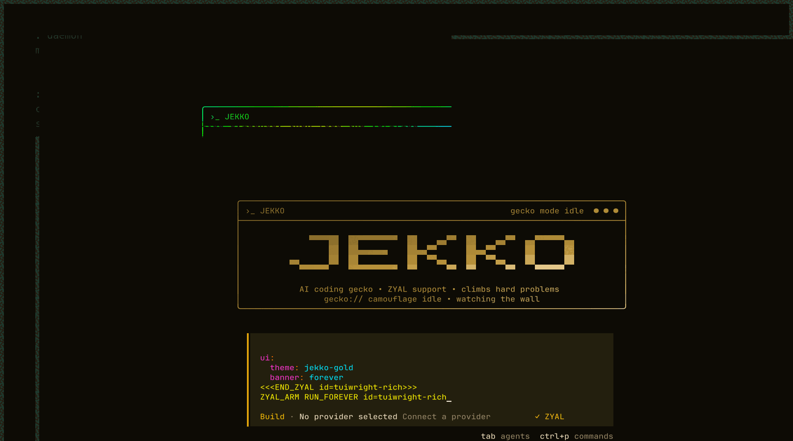

# Jekko

The open source AI coding agent, rebuilt in Rust. Jekko is a terminal-first
multi-provider coding agent: a Ratatui TUI, an Axum HTTP/OpenAPI server, an
embedded SQLite store, and a streaming provider runtime, all shipped as a
single static binary.

<p align="center">
  
</p>

## Install

Current Rust release target: `v0.1.1`. Once tagged, install via Cargo:

```bash
cargo install --git https://github.com/neverhuman/jekko --tag v0.1.1 jekko-cli
```

Or via the Nix flake (provides `jekko` on `$PATH` and a dev shell):

```bash
nix profile install github:neverhuman/jekko
```

Or build from source:

```bash
git clone https://github.com/neverhuman/jekko
cd jekko
cargo build -p jekko-cli --release --locked
# Binary at target/release/jekko
```

The release binary is self-contained: rusqlite is bundled, no system SQLite
required.

## Quick start

```bash
jekko                          # Launch the TUI (default subcommand)
jekko run "refactor auth.rs"   # One-shot prompt, prints response and exits
jekko keys set OPENAI          # Set a provider API key (prompted, stored under ~/.jekko)
jekko providers list           # Show configured providers and their default models
jekko session list             # List recent sessions
jekko serve                    # Run the HTTP API on localhost (OpenAPI at /openapi.json)
```

Run `jekko --help` for the full command tree (22 subcommands).

## Architecture

Jekko is a Cargo workspace of 8 `jekko-*` crates plus `xtask` and
`tuiwright-jekko-unlock`:

- `jekko-cli` — argument parsing, subcommand dispatch, the user-facing binary.
- `jekko-core` — shared domain types (sessions, messages, tool calls, events).
- `jekko-tui` — Ratatui + Crossterm terminal frontend.
- `jekko-server` — Axum HTTP API with `utoipa` OpenAPI generation.
- `jekko-store` — SQLite persistence via rusqlite; embedded migration journal.
- `jekko-provider` — streaming HTTP clients for OpenAI, Anthropic, Gemini, and
  the multi-provider router.
- `jekko-runtime` — agent loop, tool execution, session orchestration.
- `jekko-plugin-api` — declarative TOML plugin contract and the `JekkoPlugin`
  trait.

See [`docs/architecture.md`](docs/architecture.md) for the longer write-up.

## Testing

- Cargo test lanes, baseline matrices, and parity gates:
  [`docs/testing.md`](docs/testing.md).
- TUI-specific snapshot and TUIwright lanes:
  [`docs/testing-tui.md`](docs/testing-tui.md).

## Development

```bash
nix develop                                # Reproducible dev shell (rustc, cargo, just)
just fast                                  # Quick lane (fmt + clippy + workspace test)
just tui-ci                                # TUI snapshot + binary smoke lane
cargo run -p xtask -- ci-fast              # Full local sweep matching CI
```

Available `xtask` parity and packaging commands:

```bash
cargo run -p xtask -- db-migration-smoke
cargo run -p xtask -- cli-help-parity
cargo run -p xtask -- tool-schema-parity
cargo run -p xtask -- session-fixture-parity
cargo run -p xtask -- httpapi-parity
cargo run -p xtask -- openapi-check
cargo run -p xtask -- baseline-diff
cargo run -p xtask -- ci-fast
cargo run -p xtask -- package
cargo run -p xtask -- guard-forbidden-runtime
```

GitHub Actions is the merge gate. PRs run the remote CI suite on the
pull request itself, and protected branches require those checks to pass
before merge.

## Releasing

See [`docs/release.md`](docs/release.md) for the tagging, signing, and
artifact-publishing workflow.

## License

MIT. See [`LICENSE`](LICENSE).

---

### Migration Notes

Pre-1.0 runtime migration notes are archived at
[`docs/archive/historical/open-tui-bun-rust-port.md`](docs/archive/historical/open-tui-bun-rust-port.md). The active
workspace, build, and release paths are Rust-only.
