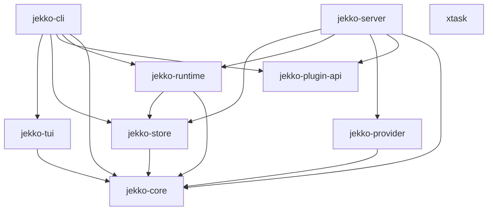

# Architecture

Jekko is a Rust Cargo workspace. The product is composed of a small number of
focused crates with a strict acyclic dependency graph. Each crate has a
narrow charter and a single owning module path.

## Crate graph

The graph is acyclic by construction. `jekko-core` is the universal leaf;
nothing in the workspace depends on `jekko-cli` or `xtask`.

## Crate charters

### `jekko-core`

Pure types, schemas, and parsers. No I/O, no global state, no async runtime.
This is the universal leaf — every other product crate depends on it, and it
depends on nothing inside the workspace.

Owns: shared domain types, JSON/YAML schemas, agent-script parsers, error
types, GitHub event normalization.

### `jekko-store`

SQLite persistence via `rusqlite`. Embeds the migration journal under
`db/migrations/` and applies migrations on open. No other crate may speak
SQL directly.

Owns: connection management, migrations, session/message/event tables,
storage-level queries.

### `jekko-runtime`

The session bus, tool execution, permission gates, daemon supervision, and
PTY/shell/MCP/LSP transports.

Owns: in-process event bus, session lifecycle, tool dispatch, permission
prompts, daemon registry, PTY adapter, shell adapter, MCP client, LSP client.

### `jekko-provider`

Provider catalog (model list, capability flags), request transforms, and
LLM streaming (SSE-based). Speaks to upstream LLM endpoints.

Owns: provider config, model catalog, request/response transforms, SSE
stream decoding, retry/backoff.

### `jekko-server`

The Axum HTTP server. Exposes the HTTP API, the SSE stream for events, the
WebSocket transport, and the PTY connect endpoint. Hosts the OpenAPI schema
generation.

Owns: HTTP route table, SSE and WebSocket handlers, PTY connect handler,
auth middleware, OpenAPI generation.

### `jekko-tui`

The Ratatui-based terminal UI. Owns the lifecycle (mount, render, teardown),
the component tree (transcript, prompt, dialogs, navigation header), input
handling, and the feature-plugin slot system.

Owns: Ratatui main loop, component implementations, dialog routing, prompt
state, transcript renderer, feature-plugin host.

### `jekko-plugin-api`

The plugin contract surface. Defines the internal `JekkoPlugin` trait used by
in-process plugins and the declarative `ExternalPluginManifest` (TOML,
semver-validated) used by external plugins. Also hosts the legacy plugin
detector that emits `MigrationWarning` for stale plugin directories.

Owns: plugin trait, `PluginRegistry`, manifest schema, migration warnings.

### `jekko-cli`

The `clap`-driven entrypoint. The binary name is `jekko`. The CLI parses
subcommands and routes into the other crates; it owns no product logic
beyond argument parsing and process lifecycle.

Owns: `clap` command tree, logging init, signal handling, process exit codes.

### `xtask`

Build automation, parity guards, and the baseline diff. Never linked into
the product binary. Invoked as `cargo run -p xtask -- <subcommand>`.

Owns: forbidden-runtime guard, baseline diff, host-binary-path helper, live
production env init, GitHub event helpers, PR/stale-PR/compliance shell
replacements.

## Conventions

- The dependency direction is one-way only. `core` is downhill of everything;
  `cli` and `server` are uphill of everything. Reverse edges are a build
  error.
- I/O lives in `runtime`, `store`, `provider`, `server`, and `tui`. `core`
  must stay pure.
- New product behavior should be added in the crate that owns its boundary,
  not split across two crates "for convenience".
- `xtask` is for automation only; do not put product behavior in it.

## Where things live

| Boundary                       | Crate                |
| ------------------------------ | -------------------- |
| Types, schemas, parsers        | `jekko-core`         |
| SQLite, migrations             | `jekko-store`        |
| Sessions, bus, tools, daemons  | `jekko-runtime`      |
| Models, providers, streaming   | `jekko-provider`     |
| HTTP, SSE, WebSocket, PTY      | `jekko-server`       |
| Terminal UI                    | `jekko-tui`          |
| Plugin trait + manifest        | `jekko-plugin-api`   |
| `clap` entrypoint              | `jekko-cli`          |
| Build/parity automation        | `xtask`              |

When in doubt, the boundary owns the behavior; do not split a boundary
across crates.
